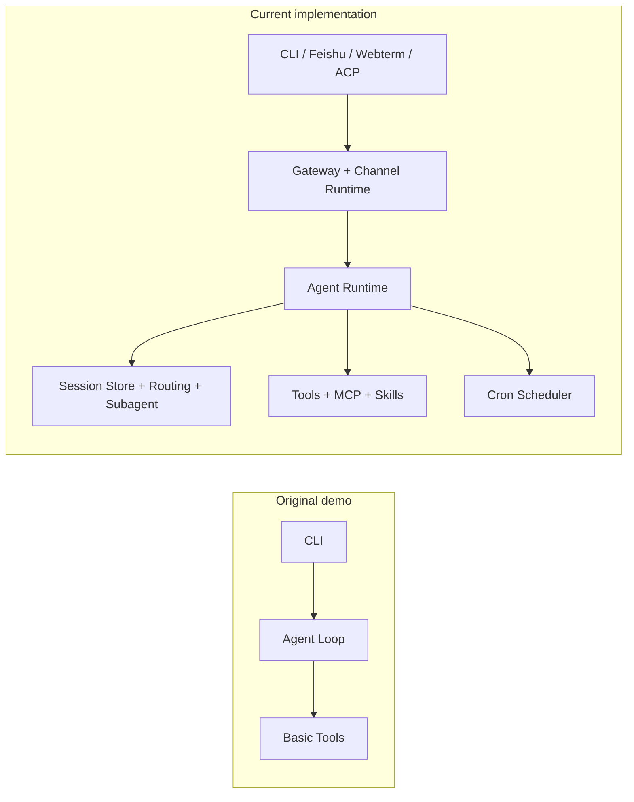

# Grape Agent

English | [中文](./README_CN.md)

Grape Agent is a lightweight but complete Agent engineering baseline. It started from `MiniMax-AI/Grape-Agent` and has evolved into a modular runtime with multi-entrypoint integration.

Project goals:

1. Help beginners understand the Agent loop: think -> call tools -> iterate.
2. Provide a reusable, minimal architecture scaffold for real projects.
3. Bridge the gap between demo code and practical systems.

## Project in 3 Minutes

### Core capabilities

- Agent execution loop with tool calls and context summarization
- Multi-entrypoint runtime: CLI, Feishu, Webterm Bridge, ACP
- Gateway control plane for sessions/channels/cron
- Pluginized channel runtime (`ChannelPlugin`)
- Multi-agent routing by source/chat/account
- Subagent orchestration (`sessions_spawn/send/history/list`)
- Cron-based isolated execution and channel delivery

### Architecture evolution (original -> current)



## Key deltas vs upstream original

| Area | Original demo | Current repository |
| --- | --- | --- |
| Entrypoints | CLI only | CLI + Feishu + Webterm Bridge + ACP |
| Control plane | none | Gateway (`health/status/sessions/channels/cron`) |
| Channel architecture | embedded style | pluginized `ChannelPlugin` runtime |
| Multi-agent routing | none | `agents + routing resolver` |
| Subagent orchestration | none | `sessions_spawn/send/history/list` |
| Scheduling | none | cron + isolated execution + channel delivery |
| Feishu capabilities | basic reply | multi-account, thread/topic routing, chunk delivery |

## Quick Start (minimum path)

### 1) Setup

```bash
# macOS/Linux
curl -LsSf https://astral.sh/uv/install.sh | sh

# clone
git clone https://github.com/<your-org>/<your-repo>.git
cd Grape-Agent
uv sync
```

### 2) Configure

```bash
mkdir -p ~/.grape
cp mini_agent/config/settings.json ~/.grape/settings.json
```

Edit `~/.grape/settings.json`:

```json
{
  "api_key": "YOUR_API_KEY_HERE",
  "api_base": "YOUR_API_BASE",
  "model": "YOUR_MODEL_NAME",
  "provider": "anthropic"
}
```

### 3) Run

```bash
# interactive CLI
uv run grape

# legacy command (still supported)
uv run grape-agent

# optional: webterm bridge
uv run grape-agent-webterm-bridge
```

## Typical scenarios

1. Local coding assistant via CLI
2. IM collaboration assistant via Feishu
3. Browser terminal troubleshooting assistant via Webterm Bridge
4. Scheduled automation via Cron delivery

## Interaction Refactor Highlights

- Terminal interaction has been refactored toward a Claude Code-like style:
  - compact startup card
  - black-on-white user input replay
  - dynamic `thinking...` line with API-reported token usage
  - cleaner shutdown and reduced noisy logs
- Feishu remote control flow has been improved:
  - pluginized channel runtime
  - inbound Feishu messages can be mirrored in terminal view
  - better session routing and chunked replies
  - more consistent channel event logging

## Repository map (core folders)

```text
mini_agent/
  agent.py                 # core Agent loop
  runtime_factory.py       # runtime assembly
  session_store.py         # session state and locks
  agents/                  # multi-agent and subagent orchestration
  routing/                 # route rules and resolver
  channels/                # plugin runtime for channels
  gateway/                 # TCP control plane
  webterm_bridge/          # HTTP bridge service
  cron/                    # scheduling and isolated execution
browser_plugin/            # Chrome webterm plugin
docs/                      # design and deployment docs
```

## Documentation Index

Primary entrypoints:

- [README (English)](./README.md)
- [README (Chinese)](./README_CN.md)

Getting started:

- [Learning Path (CN)](docs/00-intro/learning-path-cn.md)
- [Repository Structure Policy (CN)](docs/00-intro/repo-structure-policy.md)

Core modules:

- [Runtime Loop](docs/01-runtime-loop/runtime-loop-cn.md)
- [LLM & Prompt](docs/02-llm-and-prompt/llm-and-prompt-cn.md)
- [Tools & MCP](docs/03-tools-and-mcp/tools-and-mcp-cn.md)
- [Session Routing & Subagent](docs/04-session-routing-subagent/session-routing-subagent-cn.md)
- [Channels & Feishu](docs/05-channels-feishu/channels-feishu-cn.md)
- [Gateway & Webterm Bridge](docs/06-gateway-webterm/gateway-webterm-cn.md)
- [Cron & Isolation](docs/07-cron-isolation/cron-isolation-cn.md)
- [CLI & UI](docs/08-cli-ui/cli-ui-cn.md)
- [Deploy & Ops](docs/09-deploy-ops/deploy-ops-cn.md)

Governance and archive:

- [Implementation Traceability Audit (CN)](docs/00-intro/implementation-traceability-audit-cn.md)
- [Docs Subdirectory Quick Index](docs/README.md)
- [Doc Migration Map](docs/00-intro/doc-migration-map.md)

## Contributing

Issues and PRs are welcome:

- [Contributing Guide](CONTRIBUTING.md)
- [Code of Conduct](CODE_OF_CONDUCT.md)

## License

This project is licensed under [MIT](LICENSE).

## References

- Upstream original project (historical origin): https://github.com/MiniMax-AI/Grape-Agent
- Anthropic API: https://docs.anthropic.com/claude/reference
- OpenAI API: https://platform.openai.com/docs
- MCP Servers: https://github.com/modelcontextprotocol/servers
