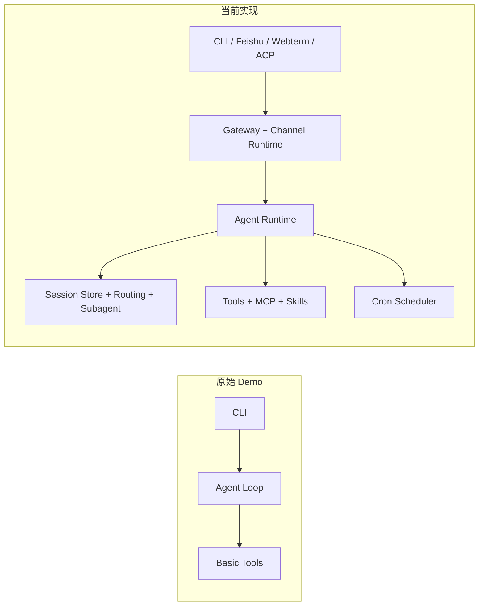

# Grape Agent

中文 | [English](./README_EN.md)

Grape Agent 是一个轻量但完整的 Agent 工程示例，最早源自 `MiniMax-AI/Grape-Agent`，现已演进为多入口、多代理、可插件化的运行时。

本项目的目标很明确：

1. 让小白能看懂 Agent 的核心执行闭环（思考 -> 工具调用 -> 迭代）。
2. 提供可直接复用的轻量架构骨架（而不是重平台）。
3. 用真实工程能力（网关、路由、编排、定时任务）帮助你从 Demo 走向可用系统。

## 3 分钟了解项目

### 核心能力

- Agent 执行循环：多步推理 + 工具调用 + 上下文压缩
- 多入口：CLI、Feishu、Webterm Bridge、ACP
- 控制面：Gateway（统一 sessions/channels/cron）
- 通道插件化：`ChannelPlugin` 接口 + Feishu 插件实现
- 多代理路由：来源/群聊/账号 -> 不同 agent/workspace
- Subagent 编排：`sessions_spawn/send/history/list` + 深度策略
- 定时任务：Cron 隔离执行 + 结果回投递通道

### 架构演进（原始 -> 当前）



## 与上游原始版本的关键差异

| 能力域   | 原始 Grape-Agent Demo | 当前版本（本仓库）                                     |
| ----- | ------------------- | --------------------------------------------- |
| 入口    | CLI 单入口             | CLI + Feishu + Webterm Bridge + ACP           |
| 控制面   | 无                   | Gateway（health/status/sessions/channels/cron） |
| 通道架构  | 偏内建                 | 插件化 `ChannelPlugin`                           |
| 多代理   | 无                   | `agents + routing resolver`                   |
| 子代理编排 | 无                   | `sessions_spawn/send/history/list`            |
| 定时任务  | 无                   | Cron + 隔离执行 + 通道投递                            |
| 飞书能力  | 无                   | 多账号、线程/话题、分片发送策略                              |

## 快速开始（最短路径）

### 1) 环境准备

```bash
# macOS/Linux
curl -LsSf https://astral.sh/uv/install.sh | sh

# 仓库
git clone https://github.com/<your-org>/<your-repo>.git
cd Grape-Agent
uv sync
```

### 2) 配置

```bash
mkdir -p ~/.grape-agent/config
cp grape_agent/config/settings.json ~/.grape-agent/config/settings.json
```

编辑 `~/.grape-agent/config/settings.json`：

```json
{
  "api_key": "YOUR_API_KEY_HERE",
  "api_base": "YOUR_API_BASE",
  "model": "YOUR_MODEL_NAME",
  "provider": "anthropic"
}
```

### 3) 启动

```bash
# 交互式 CLI
uv run grape

# 兼容旧命令（仍可用）
uv run grape-agent

# 可选：启动 webterm bridge
uv run grape-agent-webterm-bridge
```

## 典型使用场景

1. **本地开发助手（CLI）**：代码改造、脚本生成、测试修复
2. **IM 协作助手（Feishu）**：群聊触发任务、线程回复、分片输出
3. **终端排障助手（Webterm）**：桥接浏览器插件进行日志分析辅助
4. **定时自动化（Cron）**：定时巡检、结果回投递到通道

## 近期交互重构亮点

- 终端交互重构（借鉴 Claude Code 风格）：
  - 启动卡片更紧凑
  - 用户输入回显为黑底白字
  - `thinking...` 动态行与 API token 用量展示更清晰
  - 退出流程更干净，减少异常噪音
- 飞书远程控制交互优化：
  - 通道插件化运行时
  - 飞书入站消息可在终端同步观察
  - 会话路由与分片回复策略增强
  - 通道事件日志更标准化

## 仓库结构（核心目录）

```text
grape_agent/
  agent.py                 # Agent 主循环
  runtime_factory.py       # 运行时组装（LLM/Tools/Prompt）
  session_store.py         # 会话存储与并发锁
  agents/                  # 多代理与 subagent 编排
  routing/                 # 路由规则与解析
  channels/                # 通道插件运行时
  gateway/                 # TCP 控制面
  webterm_bridge/          # HTTP 桥接服务
  cron/                    # 定时任务调度与执行
browser_plugin/            # Chrome Webterm 插件
docs/                      # 详细设计与部署文档
```

## 文档导航

主入口：

- [README（中文）](./README.md)
- [README（英文）](./README_EN.md)

0) 基础概念（小白先看）：

- [学习路线（中文）](docs/00-intro/learning-path-cn.md)（总入口，建议先读，10-15 分钟）
- [Agent 核心概念（中文）](docs/00-intro/agent-core-concepts-cn.md)（术语解释，15-20 分钟）
- [一次请求的端到端调用链（中文）](docs/00-intro/e2e-call-chain-cn.md)（从输入到回复的真实链路，15-20 分钟）

1) 项目实现走读（按模块）：

- [运行时主循环](docs/01-runtime-loop/runtime-loop-cn.md)（Agent loop 如何运行，20-30 分钟）
- [模型接入与提示词注入](docs/02-llm-and-prompt/llm-and-prompt-cn.md)
- [工具系统与 MCP](docs/03-tools-and-mcp/tools-and-mcp-cn.md)
- [会话、路由与 Subagent](docs/04-session-routing-subagent/session-routing-subagent-cn.md)
- [通道插件与飞书](docs/05-channels-feishu/channels-feishu-cn.md)
- [Gateway 与 Webterm Bridge](docs/06-gateway-webterm/gateway-webterm-cn.md)
- [Cron 与隔离执行](docs/07-cron-isolation/cron-isolation-cn.md)
- [CLI 与终端交互 UI](docs/08-cli-ui/cli-ui-cn.md)

2) 实操与运维：

- [部署与运维](docs/09-deploy-ops/deploy-ops-cn.md)
- [仓库结构治理策略](docs/00-intro/repo-structure-policy.md)

治理与归档：

- [实现一致性强化审计（含代码行号）](docs/00-intro/implementation-traceability-audit-cn.md)
- [docs 子目录快速索引](docs/README.md)
- [文档迁移映射表](docs/00-intro/doc-migration-map.md)

## 贡献

欢迎提交 Issue 和 PR：

- [贡献指南](CONTRIBUTING.md)
- [行为准则](CODE_OF_CONDUCT.md)

## 许可证

本项目采用 [MIT](LICENSE) 许可证。

## 参考

- 上游原始项目（历史来源）: https://github.com/MiniMax-AI/Grape-Agent
- Anthropic API: https://docs.anthropic.com/claude/reference
- OpenAI API: https://platform.openai.com/docs
- MCP Servers: https://github.com/modelcontextprotocol/servers
- OpenClaw 项目（架构参考）: https://github.com/anthropics/openclaw
