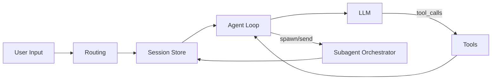

# Agent 核心概念（中文）

## 这篇给谁看

给第一次读本仓库代码的人。目标不是记术语定义，而是知道“概念在代码里对应什么”。

## 五个必须先懂的概念

1. Agent Loop：模型思考与工具执行的闭环
2. Tool：模型可调用的外部执行能力
3. Session：一次连续对话的状态容器
4. Routing：把消息分配给哪个 agent/session 的规则
5. Subagent：由主会话派生出的子会话执行单元

## 1) Agent Loop

概念：每一轮都在做“问模型 -> 看是否要调工具 -> 执行工具 -> 再问模型”。

代码锚点：

- `grape_agent/agent.py:420`（`Agent.run` 主循环）
- `grape_agent/agent.py:525`（遍历工具调用）
- `grape_agent/agent.py:510`（无工具调用即收敛返回）

## 2) Tool

概念：Tool 是一组统一接口，模型只负责“决策调用”，工具负责“真实执行”。

代码锚点：

- `grape_agent/tools/base.py:16`（`Tool` 抽象）
- `grape_agent/tools/base.py:8`（`ToolResult` 返回结构）
- `grape_agent/tools/file_tools.py:63`（`read_file`）
- `grape_agent/tools/file_tools.py:155`（`write_file`）
- `grape_agent/tools/file_tools.py:212`（`edit_file`）
- `grape_agent/tools/bash_tool.py:217`（`bash`）

## 3) Session

概念：Session 保存会话消息和执行上下文，并用锁保证同一会话串行执行。

代码锚点：

- `grape_agent/session_store.py:29`（`AgentSessionStore`）
- `grape_agent/session_store.py:14`（`AgentSession` 数据结构）
- `grape_agent/session_store.py:40`（`get_or_create`）
- `grape_agent/session_store.py:37`（会话 key 生成）

## 4) Routing

概念：Routing 决定“这条消息交给哪个 agent 处理”，并生成会话 key。

代码锚点：

- `grape_agent/routing/resolver.py:11`（`RoutingResolver`）
- `grape_agent/routing/resolver.py:38`（`resolve`）
- `grape_agent/routing/session_key.py:6`（`build_session_key`）

## 5) Subagent

概念：主会话可生成子会话执行分工任务，深度和工具权限受策略控制。

代码锚点：

- `grape_agent/agents/orchestrator.py:32`（`SessionOrchestrator`）
- `grape_agent/agents/orchestrator.py:53`（`spawn`）
- `grape_agent/agents/policy.py:10`（`SubagentPolicy`）
- `grape_agent/agents/policy.py:37`（叶子节点判定）

## 概念关系图

## 常见误区

1. 把 Agent 当成“只有模型调用”：忽略了 Tool 与 Session 才是工程落地核心
2. 把 Session 当成“聊天记录”：实际还承担并发隔离和路由键空间
3. 把 Subagent 当成“多开一个模型”：它本质是可控的会话编排机制
