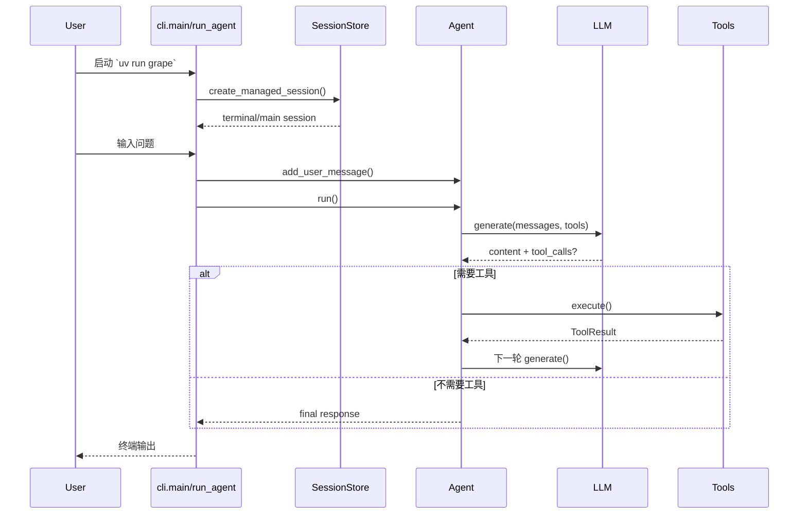

# 一次请求的端到端调用链（中文）

## 场景

以 CLI 模式为例，用户输入一句话后，系统如何一步步产出最终回答。

## 总体时序

## 分阶段走读（对应代码）

### 阶段 1：CLI 入口和启动

1. 入口函数：`grape_agent/cli.py:1462`（`main`）
2. 解析参数并进入运行函数：`grape_agent/cli.py:847`（`run_agent`）
3. 初始化通道运行时、Gateway、Cron（按配置启用）

### 阶段 2：构建运行时与会话

1. 运行时装配：`grape_agent/runtime_factory.py:324`（`build_runtime_bundle`）
2. 创建受管会话：`grape_agent/cli.py:987`（`create_managed_session`）
3. 会话注册：`grape_agent/session_store.py:40`（`get_or_create`）

### 阶段 3：接收用户输入

1. 交互循环读取输入：`grape_agent/cli.py:1214`（`while True`）
2. 写入消息历史：`grape_agent/cli.py:1365`（`agent.add_user_message(user_input)`）
3. 启动执行：`grape_agent/cli.py:1419`（`agent.run()`）

### 阶段 4：Agent 主循环执行

1. 主循环入口：`grape_agent/agent.py:420`
2. 每轮前摘要检查：`grape_agent/agent.py:453`（调用 `_summarize_messages`）
3. LLM 调用：`grape_agent/agent.py:465`
4. 工具分发执行：`grape_agent/agent.py:525`
5. 无工具调用即返回最终答案：`grape_agent/agent.py:510`

### 阶段 5：输出与收尾

1. UI 输出在 `Agent.run()` 内逐步打印（thinking、tool、assistant content）
2. 任务结束后回到 CLI 交互循环，等待下一次输入
3. 退出时统一执行 runtime/gateway/cron 清理：`grape_agent/cli.py:1447`

## 你可以怎么调试这条链

1. 先执行一个必触发工具的问题，确认看到工具调用与回填
2. 再执行一个不需要工具的问题，确认单轮直接收敛
3. 按 Esc 触发取消，确认会返回取消提示且历史不残缺
4. 通过 Gateway `status` 查看会话与通道快照：`grape_agent/gateway/handlers/status.py:8`

## 常见断点位置

1. 输入进了 CLI 但没触发模型：看 `agent.run()` 是否被调用（`grape_agent/cli.py:1419`）
2. 模型返回了但没调工具：看 `response.tool_calls` 是否为空（`grape_agent/agent.py:510`）
3. 工具报错后中断：看工具执行异常包装逻辑（`grape_agent/agent.py:540`）
