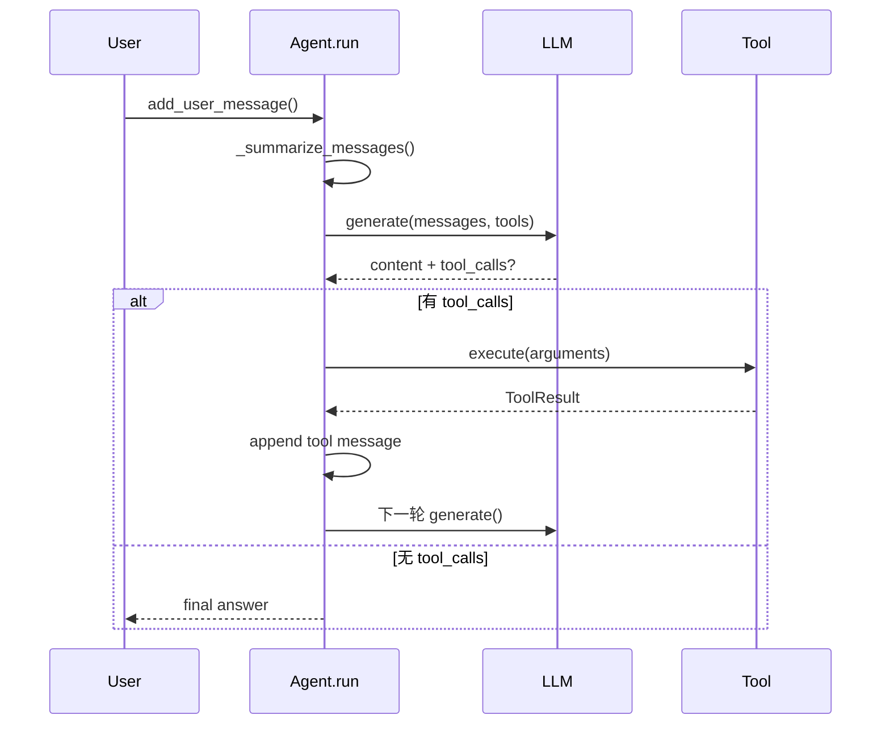

# 运行时主循环（概念 / 原理 / 实现）

## 1) 概念：主循环到底在解决什么问题

主循环的目标很简单：把“用户意图”变成“可执行动作”，直到拿到最终回答。

一次标准循环包含 4 步：

1. 把当前消息历史发给模型
2. 读取模型返回（普通回答或 `tool_calls`）
3. 若有工具调用，执行工具并把结果写回消息历史
4. 继续下一轮，直到模型不再请求工具

你可以把它理解成一个“带工具执行器的对话状态机”。

## 2) 原理：为什么要这样设计

### 2.1 防无限循环

主循环由 `max_steps` 兜底，避免模型反复调用工具不收敛。

### 2.2 防上下文爆炸

每轮调用前执行 token 检查，超过阈值才触发摘要。摘要后会跳过一次检查，避免连续摘要抖动。

### 2.3 可取消但不破坏历史一致性

取消不是“硬中断”，而是在安全点检查取消信号，清理当前未完成的 assistant/tool 消息，避免会话污染。

## 3) 本项目怎么实现（函数级走读）

### 3.1 运行时装配

`build_runtime_bundle()` 负责装配 LLM、基础工具和系统提示词，作为会话创建的依赖输入：

- `grape_agent/runtime_factory.py:324`

### 3.2 Agent 主循环

`Agent.run()` 是执行中枢：

- 入口：`grape_agent/agent.py:420`
- 循环条件：`while step < self.max_steps`（同文件内）
- LLM 调用：`self.llm.generate(messages=self.messages, tools=tool_list)`
- 终止条件：`if not response.tool_calls: return response.content`
- 工具执行：遍历 `response.tool_calls`，按工具名分发到 `self.tools[name].execute(...)`

### 3.3 摘要逻辑

`_summarize_messages()` 在每轮前执行检查：

- `grape_agent/agent.py:279`
- 触发条件：本地估算 token 或 API 返回 token 超阈值
- 摘要后重建消息结构：`system + user + summary...`

### 3.4 取消与清理

`_check_cancelled()` + `_cleanup_incomplete_messages()` 负责安全取消：

- `grape_agent/agent.py:189`
- `grape_agent/agent.py:199`

## 4) 一轮循环时序

## 5) 如何验证与调试

1. 启动：`uv run grape`
2. 输入一个明显需要工具的问题（如“读取某文件并总结”）
3. 确认输出链路包含：`thinking -> tool call -> tool result -> final`
4. 再输入长任务，确认摘要逻辑可触发（高 token 场景）
5. 试一次 Esc 取消，确认没有残留不完整消息

## 6) 最小改造练习

练习目标：把默认 `max_steps` 从配置值调小，观察行为变化。

1. 在 `Agent(...)` 创建处查看 `max_steps` 传入（`grape_agent/cli.py:1044`）
2. 临时改小后运行相同任务
3. 对比“工具调用轮数”和最终收敛质量

## 7) 常见问题

1. 模型不调工具：先检查工具 schema 是否暴露成功，再检查系统提示词是否明确要求可调用工具
2. 回答反复迭代：先收紧任务目标，再降低 `max_steps`
3. 取消后历史异常：重点核对 `_cleanup_incomplete_messages()` 是否按预期执行
