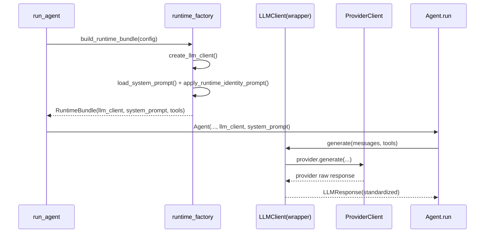

# 模型接入与提示词注入（概念 / 原理 / 实现）

## 1) 模块边界：这一层到底负责什么

这一层的职责不是“写提示词”这么简单，而是把三件事连起来：

1. 把配置里的 `provider/model/api_base/retry` 变成可调用的 LLM 客户端
2. 把系统提示词做运行时注入（身份、日期、搜索策略）
3. 把不同 provider 响应统一成内部 `LLMResponse`，让上层 `Agent` 无感知

可以把它理解为“模型适配层 + 提示词装配层 + 响应标准化层”。

## 2) 设计原理与取舍

### 2.1 为什么要统一响应结构

`Agent.run()` 只关心 `content / tool_calls / usage / provider_events`，不应该知道 Anthropic 和 OpenAI SDK 的字段差异。  
统一结构定义在：

- `grape_agent/schema/schema.py:40`（`TokenUsage`）
- `grape_agent/schema/schema.py:50`（`ProviderEvent`）
- `grape_agent/schema/schema.py:59`（`LLMResponse`）

### 2.2 为什么要做运行时提示词注入

同一份静态 prompt 无法覆盖运行时事实（当前模型、当前日期、是否启用 native web search）。  
因此在加载后再拼接“运行时护栏”：

- `grape_agent/runtime_factory.py:70`（`apply_runtime_identity_prompt`）

### 2.3 为什么要做 provider 无感切换

项目同时支持 Anthropic 协议和 OpenAI 协议，通过一个包装器完成切换：

- `grape_agent/llm/llm_wrapper.py:19`（`LLMClient`）
- `grape_agent/llm/llm_wrapper.py:87`（Anthropic 分支）
- `grape_agent/llm/llm_wrapper.py:95`（OpenAI 分支）

## 3) 关键配置项（从配置到行为）

主要配置结构：

- `grape_agent/config.py:32`（`LLMConfig`）
- `grape_agent/config.py:13`（`RetryConfig`）
- `grape_agent/config.py:23`（`NativeWebSearchConfig`）

对应行为映射：

1. `provider` 决定实例化 `AnthropicClient` 或 `OpenAIClient`
2. `retry.*` 决定是否包 `async_retry`
3. `native_web_search.*` 决定是否向请求注入 provider 原生搜索工具

## 4) 端到端调用链（从 run_agent 到 LLMResponse）

## 5) 函数级实现走读

### 5.1 runtime_factory：装配入口

1. `create_llm_client`：读取配置并创建统一包装器  
   `grape_agent/runtime_factory.py:41`
2. `load_system_prompt`：读取 prompt 文件，不存在则使用默认  
   `grape_agent/runtime_factory.py:96`
3. `apply_runtime_identity_prompt`：追加身份/日期/搜索护栏  
   `grape_agent/runtime_factory.py:70`
4. `build_runtime_bundle`：把 LLM、tools、system_prompt 组装成可复用 bundle  
   `grape_agent/runtime_factory.py:324`

### 5.2 LLM wrapper：provider 路由

`LLMClient.generate` 只是把统一输入透传给底层 provider client：

- `grape_agent/llm/llm_wrapper.py:118`

重点是初始化时根据 `provider` 选择具体实现（`AnthropicClient` / `OpenAIClient`）。

### 5.3 Anthropic 侧关键点

1. 消息转换（含 `thinking/tool_use/tool_result`）  
   `grape_agent/llm/anthropic_client.py:174`
2. native web search 工具注入与失败回退  
   `grape_agent/llm/anthropic_client.py:114`
3. 响应解析为统一结构（含 `provider_events`）  
   `grape_agent/llm/anthropic_client.py:262`
4. usage 解析（`total=prompt+completion`，cache token 单独字段）  
   `grape_agent/llm/anthropic_client.py:321`

### 5.4 OpenAI 侧关键点

1. 消息转换（assistant 中保留 `reasoning_details`）  
   `grape_agent/llm/openai_client.py:159`
2. native web search 工具注入与失败回退  
   `grape_agent/llm/openai_client.py:95`
3. 响应解析与 `tool_calls` JSON 参数反序列化  
   `grape_agent/llm/openai_client.py:248`
4. usage 标准化到 `TokenUsage`  
   `grape_agent/llm/openai_client.py:289`

## 6) 和 Agent 主循环的接口契约

`Agent.run()` 依赖以下约定：

1. `tool_calls` 为 `None` 或标准列表（有则进入工具执行分支）
2. `usage.total_tokens` 可用于 UI 显示与摘要触发判断
3. `provider_events` 可选，用于额外观测（如 server tool 事件）

调用位置：

- `grape_agent/agent.py:465`（`llm.generate`）
- `grape_agent/agent.py:480`（使用 `usage.total_tokens`）
- `grape_agent/agent.py:488`（记录 `provider_events`）

## 7) 验证步骤（建议按顺序）

1. 用 Anthropic provider 跑一次普通问答，确认有正常 `content`
2. 触发工具调用，确认 `tool_calls` 结构可被 `Agent` 执行
3. 触发网络查询，观察是否出现 provider 事件（Anthropic 更明显）
4. 切到 OpenAI provider，重复第 1-2 步，验证统一结构不变

## 8) 常见问题与定位

1. 模型没按预期回答“今天日期”
   - 检查 `apply_runtime_identity_prompt` 是否被注入（`runtime_factory.py:70`）
2. 工具参数在 provider 侧报格式错误
   - 检查对应 provider 的工具 schema 转换（Anthropic: `:143`，OpenAI: `:125`）
3. native web search 报错
   - 先确认 `model_patterns` 命中；再看回退路径是否生效（Anthropic `:131`，OpenAI `:112`）
4. usage 异常为 0
   - 检查 provider SDK 返回中是否携带 usage 字段，以及解析逻辑是否进入分支

## 9) 最小改造练习（建议动手）

目标：只改配置，不改业务代码，观察行为变化。

1. 关闭 `native_web_search.enabled`，观察 provider event 变化
2. 把 `retry.max_retries` 改小，模拟网络失败，观察重试次数
3. 切换 `provider`（Anthropic/OpenAI），验证 `Agent.run()` 侧代码无需改动
