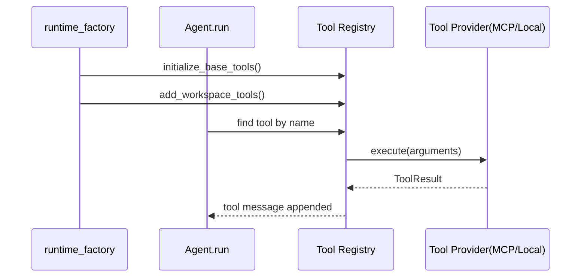

# 工具系统与 MCP（概念 / 原理 / 实现）

## 1) 模块边界

工具层负责一件核心事情：把模型的“决策调用”变成真实执行结果。

在本项目里，工具来源有 4 类：

1. 本地基础工具（`bash_output/bash_kill/get_skill` 等）
2. 工作区工具（`bash/read_file/write_file/edit_file/note`）
3. MCP 动态加载工具
4. 子代理编排工具（`sessions_*`）

## 2) 核心抽象：统一 Tool 协议

所有工具都遵守同一接口：

- `grape_agent/tools/base.py:16`（`Tool`）
- `grape_agent/tools/base.py:8`（`ToolResult`）

这保证了 `Agent.run()` 不需要关心工具来源，只按 `name -> execute(**args)` 调度。

## 3) 工具是怎么被装配进会话的

### 3.1 全局基础工具装配

- `grape_agent/runtime_factory.py:112`（`initialize_base_tools`）

按配置装载：

1. `bash_output` / `bash_kill`
2. skills（只暴露 `get_skill`，按需展开）
3. MCP tools（从配置动态连接）

### 3.2 会话级工具装配

- `grape_agent/runtime_factory.py:187`（`add_workspace_tools`）
- `grape_agent/runtime_factory.py:289`（`build_session_tools`）

会话级装配会注入 `workspace_dir`，因此同一个工具在不同 session 下有不同工作目录语义。

## 4) Agent 如何执行工具调用

在主循环中，工具执行路径固定：

1. 模型返回 `tool_calls`
2. 遍历每个 tool call，按工具名查字典
3. 成功或异常都转成 `ToolResult` 回填消息

关键代码：

- `grape_agent/agent.py:525`（遍历 `tool_calls`）
- `grape_agent/agent.py:533`（未知工具处理）
- `grape_agent/agent.py:540`（执行与异常捕获）

## 5) 内建工具详解

### 5.1 文件工具（读/写/编辑）

文件工具实现：

- `grape_agent/tools/file_tools.py:63`（`ReadTool`）
- `grape_agent/tools/file_tools.py:155`（`WriteTool`）
- `grape_agent/tools/file_tools.py:212`（`EditTool`）

关键行为：

1. 相对路径按 `workspace_dir` 解析（`:113`, `:200`, `:261`）
2. `read_file` 支持 `offset/limit` 分块读取（`:127`）
3. 读取结果会做 token 截断，避免超长输出（`:147`）

### 5.2 Bash 工具（前台 + 后台）

实现文件：

- `grape_agent/tools/bash_tool.py:217`（`BashTool`）
- `grape_agent/tools/bash_tool.py:441`（`BashOutputTool`）
- `grape_agent/tools/bash_tool.py:535`（`BashKillTool`）

关键能力：

1. `bash` 支持前台超时与后台执行（`:309`, `:341`, `:399`）
2. 后台任务由 `BackgroundShellManager` 管理（`:108`）
3. 通过 `bash_output` 轮询增量输出，通过 `bash_kill` 终止

### 5.3 Skill 工具（按需展开）

实现：

- `grape_agent/tools/skill_tool.py:13`（`GetSkillTool`）
- `grape_agent/tools/skill_tool.py:57`（`create_skill_tools`）

设计点：系统提示词只注入 skills metadata，完整 skill 内容在需要时通过 `get_skill` 拉取，避免 prompt 体积失控。

## 6) MCP 动态工具加载（重点）

入口：

- `grape_agent/tools/mcp_loader.py:342`（`load_mcp_tools_async`）

关键机制：

1. 支持 `stdio/sse/http/streamable_http` 连接类型（`:18`, `:300`）
2. 全局与 per-server 超时配置（`:21`, `:46`, `:417`）
3. 每个 MCP tool 包一层 `MCPTool.execute`，带执行超时保护（`:72`, `:101`）
4. 连接生命周期由全局 registry 管理，退出时统一清理（`:297`, `:440`）

## 7) 工具系统时序图

## 8) 实操验证清单

1. 触发 `read_file`，验证行号格式与分块参数
2. 触发 `bash` 前台命令，验证 timeout 生效
3. 触发 `bash` 后台命令，再用 `bash_output` 查看增量输出
4. 开启 MCP，观察工具数量变化与连接日志
5. 调用 `get_skill`，验证技能按需展开

## 9) 风险与排查

1. MCP 连接慢/挂死
   - 检查 connect/execute/sse_read timeout（`mcp_loader.py:46`）
2. 文件写错目录
   - 检查当前 session 的 `workspace_dir` 及相对路径解析逻辑
3. bash 后台任务泄漏
   - 检查是否调用了 `bash_kill`，以及进程是否从 manager 移除
4. 子代理叶子节点还能调 `sessions_*`
   - 检查 `build_session_tools` 的 deny 过滤是否生效

## 10) 最小改造练习

1. 在 `read_file` 中把默认 `max_tokens` 从 32000 改小，观察输出变化
2. 将 `mcp.execute_timeout` 调低，模拟慢工具并观察超时报错
3. 为 `bash` 增加一条命令 deny 逻辑（比如限制高风险命令），验证错误路径
