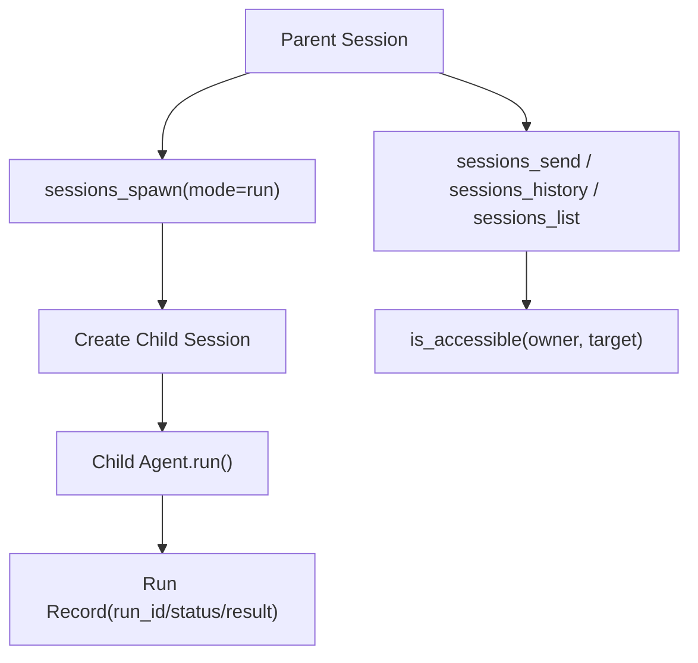

# 会话、路由与 Subagent（概念 / 原理 / 实现）

## 1) 这一层解决什么问题

这层解决三个工程问题：

1. 一条消息属于哪个逻辑会话（Session Identity）
2. 这条消息应该由哪个 agent 处理（Routing）
3. 主会话如何安全地派生并管理子会话（Subagent Orchestration）

## 2) Session 键空间与隔离模型

标准会话键格式：

- `agent:{agent_id}:{channel}:{chat_id}`
- `grape_agent/routing/session_key.py:6`

为什么这样设计：

1. `agent_id` 维度保证多代理互不污染
2. `channel/chat_id` 维度保证多入口（CLI/Feishu/Cron）可并存
3. 字符串键可直接作为日志、索引、跨组件传递标识

## 3) 会话存储：一致性与并发

核心结构：

- `grape_agent/session_store.py:14`（`AgentSession`）
- `grape_agent/session_store.py:29`（`AgentSessionStore`）

关键点：

1. `get_or_create` 用 `_guard` 保证会话创建原子性（`:40`）
2. 每个 `AgentSession` 自带 `lock`，同一会话串行执行，避免消息历史交错
3. 支持按 key、按 channel/session 粒度回收会话（`:72`, `:81`）

## 4) 路由解析：规则优先，默认兜底

入口：

- `grape_agent/routing/resolver.py:11`（`RoutingResolver`）
- `grape_agent/routing/resolver.py:38`（`resolve`）

行为：

1. 按配置顺序匹配规则，命中即返回（包含 `matched_by=rule:{idx}`）
2. 未命中时回落到默认 agent（`matched_by=default`）
3. 无论命中与否，都会产出标准 `session_key`

## 5) Subagent 编排：可控的“会话树”

编排器：

- `grape_agent/agents/orchestrator.py:32`（`SessionOrchestrator`）
- `grape_agent/agents/orchestrator.py:53`（`spawn`）
- `grape_agent/agents/orchestrator.py:157`（`send`）

策略：

1. 最大深度限制（`parent.depth >= max_depth` 直接拒绝）  
   `grape_agent/agents/orchestrator.py:69`
2. 访问控制：只允许访问自己和后代会话  
   `grape_agent/agents/orchestrator.py:197`
3. 运行记录（run_id/status/result/error）可查询  
   `grape_agent/agents/orchestrator.py:183`

## 6) sessions_* 工具如何映射编排器能力

工具实现：

- `grape_agent/tools/sessions_spawn_tool.py:12`
- `grape_agent/tools/sessions_send_tool.py:12`
- `grape_agent/tools/sessions_history_tool.py:12`
- `grape_agent/tools/sessions_list_tool.py:12`

映射关系：

1. `sessions_spawn` -> `orchestrator.spawn`（支持 `mode=create|run`）
2. `sessions_send` -> `orchestrator.send`（可 `wait=true`）
3. `sessions_history` -> `orchestrator.history`（带可见性校验）
4. `sessions_list` -> `orchestrator.list_accessible_sessions`

## 7) 叶子节点权限收缩

策略定义：

- `grape_agent/agents/policy.py:10`（`SubagentPolicy`）
- `grape_agent/agents/policy.py:37`（`is_leaf`）

在会话创建时，如果当前深度为叶子，会从工具列表里剔除 `sessions_*`：

- `grape_agent/cli.py:1018`（`deny_tool_names`）
- `grape_agent/runtime_factory.py:317`（`filter_tools_by_name`）

## 8) CLI 中的真实接线点

`run_agent` 内会把这些模块串起来：

1. 创建 `session_store` 与 `agent_registry`  
   `grape_agent/cli.py:910`, `:911`
2. 构建 `create_managed_session` 工厂  
   `grape_agent/cli.py:987`
3. 注入 sessions_* 工具到会话  
   `grape_agent/cli.py:1009`
4. 创建 `SessionOrchestrator` 并挂到 channel/gateway 上下文  
   `grape_agent/cli.py:1059`, `:1065`, `:1099`

## 9) 会话树执行时序

## 10) 验证步骤（建议实操）

1. 配置至少两个 agent profile 与 routing 规则
2. 从不同入口（如 terminal / feishu）发消息，确认路由到不同 agent
3. 在主会话执行 `sessions_spawn` 创建子会话
4. 用 `sessions_send(wait=true)` 下发任务并拿回结果
5. 在深度到达叶子后验证 `sessions_spawn` 被策略拒绝

## 11) 常见故障与定位

1. “会话串台”
   - 检查 session key 是否包含正确 `agent/channel/chat_id`
2. “并发执行导致消息顺序错乱”
   - 检查是否通过 `session.lock` 串行执行
3. “子代理无限递归”
   - 检查 `max_depth` 和叶子 deny 工具策略
4. “能看到不该看的会话”
   - 检查 `is_accessible` 的父链判断逻辑

## 12) 最小改造练习

1. 把 `max_depth` 从 2 改为 1，验证多级 spawn 立即失败
2. 给 `sessions_list` 增加默认 `channel` 过滤，观察结果集合变化
3. 在 `handle_sessions_spawn`（gateway）里补充参数校验错误信息，验证返回结构
