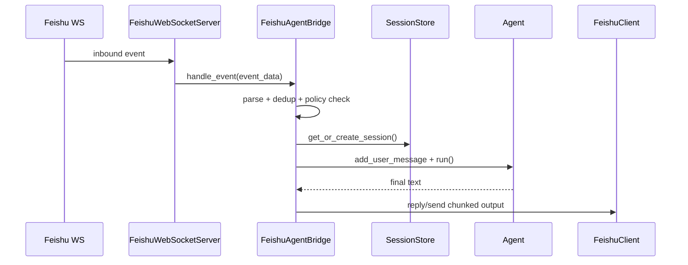

# 通道插件与飞书（概念 / 原理 / 实现）

## 1) 模块边界

通道层做两件事：

1. 把外部消息系统（飞书）接入为内部会话输入
2. 把 Agent 输出按通道能力（文本/卡片/分片/线程）回投递

它不是业务决策层，而是“消息适配 + 生命周期管理 + 投递策略”层。

## 2) 通道插件抽象

统一接口定义在：

- `grape_agent/channels/types.py:28`（`ChannelPlugin`）
- `grape_agent/channels/types.py:17`（`ChannelContext`）

`ChannelContext` 里包含：

1. 全局配置
2. `session_store`
3. `subagent_orchestrator`
4. `on_inbound_message`（给 CLI 做远程入站回显）

## 3) 运行时管理器（ChannelRuntime）

实现：

- `grape_agent/channels/runtime.py:12`（`ChannelRuntime`）

关键行为：

1. `start`：按配置启动已启用通道插件（`:21`）
2. `send`：统一 outbound 调用与日志（`:52`）
3. `snapshot`：输出可观测状态（`:68`）

默认注册：

- `grape_agent/channels/runtime.py:103`（`build_default_registry`，内置 Feishu）

## 4) Feishu 插件：多账号包装层

实现：

- `grape_agent/channels/plugins/feishu/plugin.py:21`（`FeishuChannelPlugin`）

职责：

1. 读取 `channels.feishu.accounts` 并为每个账号启动 runner（`:41`）
2. `send` 支持 `mode=send|reply`、`message_type`、`reply_in_thread`（`:64`）
3. `snapshot` 汇总多账号运行状态（`:100`）

## 5) WS 服务入口与桥接

WS 服务入口：

- `grape_agent/feishu/server_ws.py:24`（`FeishuWebSocketServer`）
- `grape_agent/feishu/server_ws.py:84`（`start`）
- `grape_agent/feishu/server_ws.py:226`（事件回调 `_handle_message_event`）

桥接核心：

- `grape_agent/feishu/bridge.py:46`（`FeishuAgentBridge`）
- `grape_agent/feishu/bridge.py:127`（`handle_event`）

## 6) 入站处理全链路（重点）

`handle_event` 主要步骤：

1. 解析事件，提取消息结构（`:129`）
2. 去重（chat_id + message_id），防止重复消费（`:134`）
3. 过滤自发消息与群聊未 @ 机器人消息（`:140`, `:145`）
4. 清洗文本（去 @），空内容直接提示（`:152`）
5. 打印入站回显到终端（如果配置了 callback）（`:158`）
6. 路由解析与 session scope 计算（`:171`, `:172`）
7. 创建/复用会话并加锁执行 `Agent.run()`（`:182`, `:183`, `:188`）
8. 最终结果分片回投（`:198`, `:530`）

## 7) 路由、会话域与策略

路由：

- `grape_agent/feishu/bridge.py:200`（`_resolve_route`，调用 `RoutingResolver`）

会话域策略：

- `group / group_sender / topic` 由 policy 决定 session 粒度
- 作用点：`resolve_session_scope_id` 调用后可能把同群不同消息映射到不同会话

## 8) 输出投递与流式体验

### 8.1 处理中 ACK

- `grape_agent/feishu/bridge.py:527`（先回“敲键盘中”）

### 8.2 分片与节流

- `grape_agent/feishu/bridge.py:530`（`_send_chunked_reply`）
- `chunk_size/interval_ms/reply_all_chunks` 受配置控制

### 8.3 进度卡片（可选）

- `grape_agent/feishu/bridge.py:273`（进度卡循环）
- `grape_agent/feishu/bridge.py:445`（构造进度卡内容）

## 9) CLI 侧远程入站回显

在 CLI `run_agent` 中绑定回调：

- `grape_agent/cli.py:924`（`print_user_input_line`）
- `grape_agent/cli.py:930`（`channel_context.on_inbound_message = ...`）

当 `ui.style=claude` 时，飞书入站会显示为黑底白字，方便观察远程控制流。

## 10) 时序图（WS 入站到回投）

## 11) 验证步骤

1. 开启 `channels.feishu.enabled=true` 且配置账号凭据
2. 启动主程序，确认 `channels.snapshot` 显示 feishu running
3. 在群聊 `@机器人` 发消息，确认被处理
4. 发长文本任务，确认出现分片/进度卡（按配置）
5. 切换 `group_session_scope`，验证会话复用行为变化

## 12) 常见故障与定位

1. 收不到消息
   - 先看 WS 是否已连接（`server_ws.start`），再看飞书应用事件订阅
2. 重复回复
   - 检查 dedup 是否生效（`bridge.py:134`）
3. 群聊不响应
   - 检查 `require_mention` 配置，以及消息是否确实 @ 机器人
4. 只回复第一段
   - 检查 `streaming.enabled/chunk_size/reply_all_chunks`

## 13) 最小改造练习

1. 在 `_build_user_message` 中加入 chat 元数据前缀，观察模型行为变化
2. 调整 `progress_card_update_sec`，观察进度卡刷新频率
3. 新增一个 `bridge.event.*` 日志字段（如 route.matched_by），便于线上排障
