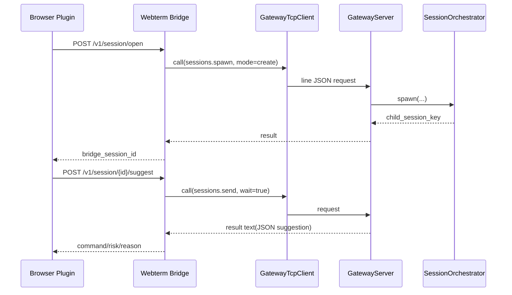

# Gateway 与 Webterm Bridge（概念 / 原理 / 实现）

## 1) 模块边界

这部分是“控制面 + 外部接入层”：

1. Gateway：进程内 TCP JSON-RPC 风格控制面
2. Webterm Bridge：给浏览器插件用的 HTTP 层，负责鉴权、会话映射、命令建议

核心原则：插件不直接碰 Agent 内部对象，只通过 Gateway 方法交互。

## 2) Gateway 协议模型

定义文件：

- `grape_agent/gateway/protocol.py:36`（`GatewayRequest`）
- `grape_agent/gateway/protocol.py:52`（`GatewayResponse`）
- `grape_agent/gateway/protocol.py:61`（`ConnectionContext`）
- `grape_agent/gateway/protocol.py:71`（`GatewayContext`）

请求格式固定：

1. `id`
2. `method`
3. `params`
4. `auth`（token/client_id/role）

## 3) Gateway 服务与路由

### 3.1 TCP Server

- `grape_agent/gateway/server.py:18`（`GatewayServer`）
- `grape_agent/gateway/server.py:33`（`asyncio.start_server`）
- `grape_agent/gateway/server.py:75`（单行 JSON 分发）

### 3.2 方法路由

- `grape_agent/gateway/router.py:22`（`GatewayRouter`）
- `grape_agent/gateway/router.py:32`（`dispatch`）

特点：

1. 同时支持 sync/async handler
2. 统一错误包裹为 `ERR_*`
3. handler 必须返回 dict

### 3.3 内建方法注册

- `grape_agent/gateway/handlers/__init__.py:28`（`register_builtin_handlers`）

默认包含：

1. `health` / `status`
2. `channels.status` / `channels.send`
3. `sessions.*`
4. `cron.*`

## 4) 核心 handler 说明

1. `status`：进程级状态聚合（session/channel/gateway/subagent/cron）  
   `grape_agent/gateway/handlers/status.py:8`
2. `channels.send`：向通道投递消息  
   `grape_agent/gateway/handlers/channels.py:16`
3. `sessions.spawn/send/history/...`：子会话编排接口  
   `grape_agent/gateway/handlers/sessions.py:27`
4. `cron.jobs.* / cron.trigger`：任务管理与触发  
   `grape_agent/gateway/handlers/cron.py:24`, `:66`

## 5) Webterm Bridge：为什么要单独一层

原因：

1. 浏览器插件更适合调用 HTTP，不适合直接 TCP 长连 JSON 协议
2. Bridge 可以实现插件侧鉴权、命令风险封装、上下文剪裁
3. Bridge 可以稳定对接 Gateway，而无需插件了解内部实现细节

## 6) Webterm Bridge 实现拆解

### 6.1 FastAPI 服务

- `grape_agent/webterm_bridge/server.py:24`（`create_app`）
- `grape_agent/webterm_bridge/server.py:67`（`/health`）
- `grape_agent/webterm_bridge/server.py:71`（`/v1/session/open`）
- `grape_agent/webterm_bridge/server.py:97`（`/v1/session/{id}/suggest`）
- `grape_agent/webterm_bridge/server.py:117`（`/v1/session/{id}/execute`）

### 6.2 到 Gateway 的 TCP 客户端

- `grape_agent/webterm_bridge/gateway_client.py:14`（`GatewayTcpClient`）
- `grape_agent/webterm_bridge/gateway_client.py:23`（`call`）

请求路径：Bridge -> `sessions.spawn/sessions.send` 等 Gateway 方法。

### 6.3 会话管理与建议命令

- `grape_agent/webterm_bridge/session_manager.py:36`（`WebtermSessionManager`）
- `grape_agent/webterm_bridge/session_manager.py:47`（`open_session`）
- `grape_agent/webterm_bridge/session_manager.py:109`（`suggest`）
- `grape_agent/webterm_bridge/session_manager.py:154`（`prepare_execute`）

关键策略：

1. `host|scope|user` 逻辑键可复用同一 bridge session
2. 上下文做行数/字符裁剪，避免 prompt 爆炸
3. 命令风险分级 + 可选 marker 包装，降低误执行风险

## 7) 启动接线点（CLI 主进程）

在 `run_agent` 中：

1. 创建 `GatewayContext`（持有 session/channel/subagent/cron 引用）  
   `grape_agent/cli.py:1092`
2. 注册 handlers 并启动 Gateway server  
   `grape_agent/cli.py:1103`, `:1104`, `:1105`

## 8) 端到端时序（插件 -> Bridge -> Gateway -> Agent）

## 9) 验证清单

1. 启动主程序并启用 gateway（含 token）
2. 直接用 TCP 发 `status` 请求，确认响应结构完整
3. 启动 bridge，调用 `/health`
4. 调 `/v1/session/open` 创建会话，再调 `/suggest` 观察命令建议
5. 关闭 gateway token 或传错 token，验证鉴权失败路径

## 10) 常见故障与定位

1. Bridge 连不上 Gateway
   - 检查 host/port/token 配置一致性
2. `sessions.spawn` 返回失败
   - 检查 `parent_session_key` 是否存在
3. `suggest` 超时
   - 检查 Gateway 调用超时配置（Bridge 默认 90s）
4. Gateway 返回 `METHOD_NOT_FOUND`
   - 检查 `register_builtin_handlers` 是否注册对应方法

## 11) 最小改造练习

1. 新增一个 `gateway` 方法（如 `sessions.count_by_channel`），并在 Bridge 增加对应 HTTP endpoint
2. 给 Bridge 的 `/suggest` 增加 `max_lines` 上限保护提示
3. 在 Gateway 的 `status` 返回中增加 `webterm_bridge` 可观测字段
