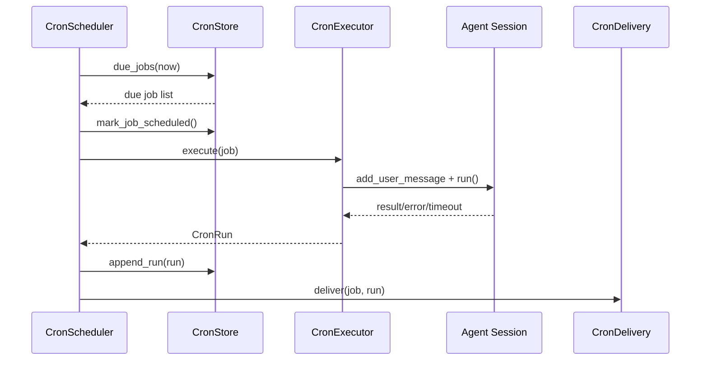

# Cron 与隔离执行（概念 / 原理 / 实现）

## 1) 模块边界

Cron 子系统负责“定时触发 + 会话执行 + 结果投递”闭环：

1. 任务持久化（job/runs）
2. 到点调度与并发控制
3. 调用 Agent 执行任务
4. 将结果回投递到指定通道

## 2) 数据模型

定义在：

- `grape_agent/cron/models.py:157`（`CronJob`）
- `grape_agent/cron/models.py:194`（`CronRun`）

`CronJob` 关键字段：

1. `schedule`：支持 `@every` 和 5 段 cron 表达式
2. `session_target`：`isolated` 或 `sticky`
3. `channel_target`：投递目标（channel/target/options）
4. `timeout_sec`：单任务执行超时

## 3) 调度表达式与下一次执行计算

调度解析实现：

- `grape_agent/cron/models.py:107`（`parse_schedule`）
- `grape_agent/cron/models.py:142`（`compute_next_run_at`）

支持：

1. `@every 10s/5m/1h`
2. 标准 5 字段 cron

## 4) 持久化存储（CronStore）

实现：

- `grape_agent/cron/store.py:14`（`CronStore`）

关键行为：

1. 启动时从 JSON 加载 job/run（`:25`）
2. `upsert_job` 时自动补 `next_run_at`（`:64`, `:75`）
3. `due_jobs` 根据 `next_run_at <= now` 取到期任务（`:89`）
4. run 历史按上限裁剪（`:116`）

## 5) 调度器（CronScheduler）

实现：

- `grape_agent/cron/scheduler.py:16`（`CronScheduler`）

核心机制：

1. 后台 loop 按 `poll_interval_sec` 轮询（`:71`, `:82`）
2. 用 `Semaphore` 限制最大并发（`:31`, `:76`）
3. 任务执行后追加 run 并尝试投递（`:89`-`:92`）

## 6) 执行器（CronExecutor）与会话策略

实现：

- `grape_agent/cron/executor.py:16`（`CronExecutor`）
- `grape_agent/cron/executor.py:27`（`execute`）
- `grape_agent/cron/executor.py:78`（`_session_id_for`）

策略差异：

1. `sticky`：固定 session_id = `job_{id}`，跨次共享上下文
2. `isolated`：每次生成新 session_id，天然隔离

执行流程：

1. 创建/获取 cron channel 会话
2. `session.lock` 串行执行该会话任务
3. `asyncio.wait_for` 套超时
4. 产出 `CronRun(status/result/error)`

## 7) 结果投递（CronDelivery）

实现：

- `grape_agent/cron/delivery.py:10`（`CronDelivery`）
- `grape_agent/cron/delivery.py:16`（`deliver`）

行为：

1. `channel_target` 缺失则跳过（非失败）
2. 调 `channels_runtime.send(...)` 发到通道
3. 构造统一文本体，包含 job/status/run_id/result/error

## 8) Gateway 的 cron 管理接口

入口：

- `grape_agent/gateway/handlers/cron.py:8`（`cron.status`）
- `grape_agent/gateway/handlers/cron.py:24`（`cron.jobs.upsert`）
- `grape_agent/gateway/handlers/cron.py:66`（`cron.trigger`）

可以远程完成：

1. 增删改查 job
2. 查询 run 历史
3. 手动触发任务

## 9) 启动接线（主进程）

在 `run_agent` 中：

1. 检查 `config.cron.enabled`
2. 创建 `CronStore/CronExecutor/CronDelivery/CronScheduler`
3. `await cron_scheduler.start()`

代码位置：

- `grape_agent/cli.py:1076`-`1091`

## 10) 时序图（到点执行一次）

## 11) 验证步骤

1. 开启 `cron.enabled=true`
2. 通过 `cron.jobs.upsert` 新建一个 `@every 1m` 任务
3. 观察 `cron.status` 中 scheduler 运行状态
4. 查询 `cron.runs.list`，确认 run 记录落库
5. 配置 `channel_target` 后验证结果消息回投

## 12) 常见故障与定位

1. 任务一直不触发
   - 检查 `enabled`、`next_run_at`、系统时区与时间同步
2. 任务频繁超时
   - 检查 `timeout_sec` 与任务本身复杂度
3. 投递失败
   - 检查通道是否 running，以及 `channel_target.channel/target` 是否有效
4. sticky 污染上下文
   - 改为 `isolated`，或在任务提示词里先做上下文清理

## 13) 最小改造练习

1. 给 `CronDelivery._build_message` 增加耗时字段，提升可观测性
2. 在 `CronStore` 增加失败次数统计，支持简单熔断策略
3. 扩展 `cron.status` 返回最近一次 run 摘要
