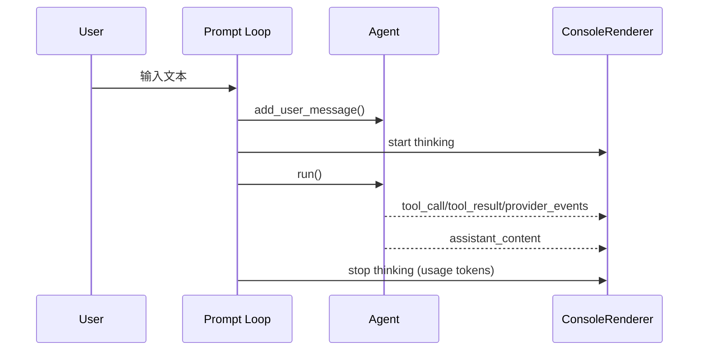

# CLI 与终端交互 UI（概念 / 原理 / 实现）

## 1) 模块边界

CLI 层负责“人和 Agent 的交互回路”：

1. 启动配置与运行时依赖
2. 输入采集与命令分发
3. 执行过程可视化（thinking/tool/result）
4. 中断与退出清理

## 2) 入口与运行主干

入口：

- `grape_agent/cli.py:1462`（`main`）
- `grape_agent/cli.py:847`（`run_agent`）

`main` 只做参数解析和 workspace 选择，真正业务流程都在 `run_agent`。

## 3) UI 渲染器：样式与事件

渲染器实现：

- `grape_agent/ui/renderer.py:50`（`ConsoleRenderer`）
- `grape_agent/ui/renderer.py:74`（`from_runtime`）

可选样式：

- `legacy / compact / claude`（`grape_agent/config.py:124`）

关键渲染事件：

1. thinking 动态行  
   `renderer.py:111`（start）, `:144`（stop）
2. tool 调用展示  
   `renderer.py:211`
3. tool 结果展示  
   `renderer.py:230`
4. 最终回答渲染  
   `renderer.py:255`

## 4) 输入循环与命令系统

交互循环位置：

- `grape_agent/cli.py:1214`（`while True`）

流程：

1. `PromptSession.prompt_async()` 读取输入（`:1229`）
2. `/` 开头走命令分支（`:1243`）
3. 普通输入写入 `agent.add_user_message`（`:1365`）
4. 启动 `agent.run()`（`:1419`）

内置命令（核心）：

1. `/help`
2. `/clear`
3. `/history`
4. `/stats`
5. `/log`
6. `/config`
7. `/exit`

## 5) Claude 风格 UI 的关键细节

### 5.1 thinking 动态行

实现机制：

1. 后台线程每秒刷新一次 elapsed（`renderer.py:122`-`:139`）
2. 完成后用真实 API usage token 覆盖最终状态（`renderer.py:159`-`:167`）

### 5.2 输入回显抹除

为兼容不支持 `erase_when_done` 的 prompt_toolkit 版本，CLI 有兜底抹除逻辑：

- `grape_agent/cli.py:1200`（`_erase_prompt_echo`）

## 6) 取消机制（Esc）与一致性保证

CLI 侧：

1. 为每次任务创建 `cancel_event`（`cli.py:1367`）
2. 启动 Esc 监听线程（`cli.py:1373`）
3. 按 Esc 后 set cancel_event（`cli.py:1406`-`:1408`）

Agent 侧：

1. 每轮安全点检查取消（`agent.py:445`, `:518`）
2. 取消时清理不完整消息（`agent.py:446`, `:519`）

这保证了“可中断，但会话历史不损坏”。

## 7) 远程通道入站在 CLI 的可观测性

当启用 Feishu 通道并使用 `claude` UI 样式时：

1. `run_agent` 绑定 `on_inbound_message` 回调（`cli.py:930`）
2. 飞书入站会在终端同步显示（黑底白字）

用于排查“远程消息是否成功入站”非常有效。

## 8) 启停与资源清理

退出清理在 `finally`：

- `grape_agent/cli.py:1447` 开始

按顺序停止：

1. cron scheduler
2. gateway server
3. channel runtime
4. MCP 连接清理（`_quiet_cleanup`）

## 9) 时序图（一次交互）

## 10) 验证步骤

1. `uv run grape` 启动 CLI
2. 触发一个工具调用任务，观察 `tool_call -> tool_result` 显示
3. 长任务中按 Esc，验证任务取消且界面恢复
4. 执行 `/clear` 后确认消息计数归零（新 session）
5. `Ctrl+C` 退出，确认没有异常 traceback 噪音

## 11) 常见故障与定位

1. 输入后无响应
   - 看 `agent.run()` 是否被启动（`cli.py:1419`）
2. token 显示始终为 0
   - 看 provider 返回 usage，和 `stop_thinking_status` 输入值
3. `/config` 切换后行为异常
   - 检查 runtime cache 是否已清空并重建 session（`cli.py:1320`）
4. 退出时挂住
   - 检查 channel/gateway/cron stop 流程是否卡住

## 12) 最小改造练习

1. 给 `/history` 增加最近 3 条消息预览
2. 在 `tool_result` 显示中增加执行耗时字段
3. 为 `claude` 样式增加可选“显示 steps”开关
