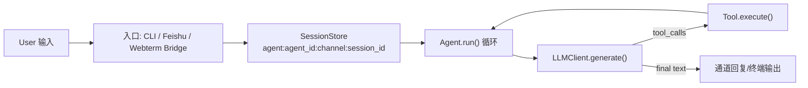
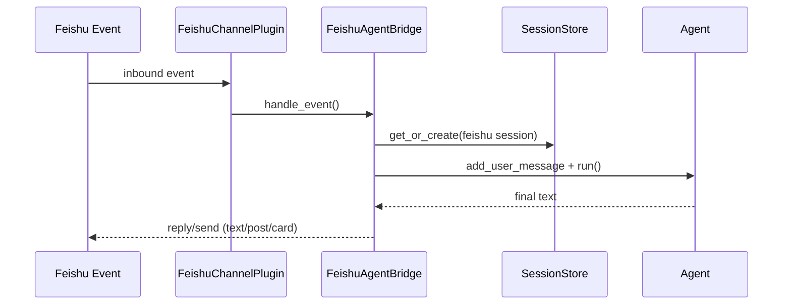

# Grape-Agent 设计与实现全景指南（小白入门版）

> 目标读者：第一次接触 Agent 开发的同学，或希望快速理解本项目架构并可动手扩展的开发者。  
> 阅读目标：读完后你能回答三个问题：
> 1) Agent 到底是怎么“思考 + 调工具 + 迭代”的？
> 2) 这个项目里一条消息是如何从入口走到回复的？
> 3) 我如何安全地扩展一个新工具/新通道/新网关能力？

---

## 0. 5 分钟快速跑通（先有体感，再看原理）

### 0.1 安装与准备

```bash
cd /Users/kxr/learning/Grape-Agent
uv sync
cp mini_agent/config/config-example.yaml mini_agent/config/config.yaml
```

编辑 `mini_agent/config/config.yaml`，至少填：

- `api_key`
- `api_base`
- `model`
- `provider`

### 0.2 启动 CLI Agent

```bash
uv run grape-agent
```

输入一个任务，例如：

- “读取 README_CN.md，提炼 5 条项目亮点”

你会看到 Agent 自动进入“思考 -> 调工具 -> 汇总回复”的循环。

### 0.3 启动 Bridge（可选）

新开终端：

```bash
uv run grape-agent-webterm-bridge
```

验证健康检查：

```bash
curl -s http://127.0.0.1:8766/health
```

---

## 1. 先建立正确心智模型：什么是“Agent”

在这个项目里，Agent 不是一个“单次问答函数”，而是一个**循环系统**：

1. 接收用户任务（`user message`）
2. 调用 LLM 生成下一步行动（纯文本回答或工具调用）
3. 如果是工具调用，执行工具并把结果喂回会话
4. 继续下一轮决策，直到任务完成或达到步数上限

核心循环在 [agent.py](/Users/kxr/learning/Grape-Agent/mini_agent/agent.py)。

---

## 2. 项目分层总览

这个仓库已经不是“只有 CLI 的 demo”，而是一个可扩展的多入口 Agent 运行时。你可以把它理解为 8 层：

1. **配置层**：读取并校验 `config.yaml`（模型、工具、通道、网关、定时任务）
2. **LLM 适配层**：统一 Anthropic/OpenAI 协议调用
3. **工具层**：文件工具、Shell 工具、Skills、MCP、会话编排工具
4. **Agent 循环层**：多步推理 + 工具执行 + 消息历史压缩
5. **会话层**：按 `agent:agent_id:channel:session_id` 管理会话状态与并发锁
6. **通道层**：Feishu 插件化运行时，支持 inbound/outbound
7. **控制面层（Gateway）**：TCP JSON 协议，统一对外管理 sessions/channels/cron
8. **桥接层（Webterm Bridge）**：浏览器插件调用的本地/远端 HTTP 网关

### 2.1 核心数据流（概览图）



---

## 3. 目录与关键文件地图（建议先收藏）

### 3.1 启动与组装

- [cli.py](/Users/kxr/learning/Grape-Agent/mini_agent/cli.py): 主入口，组装 runtime、启动 channel/gateway/cron
- [runtime_factory.py](/Users/kxr/learning/Grape-Agent/mini_agent/runtime_factory.py): 构建 LLM、工具、system prompt
- [config.py](/Users/kxr/learning/Grape-Agent/mini_agent/config.py): 配置模型定义、加载、校验、默认路径策略

### 3.2 Agent 核心

- [agent.py](/Users/kxr/learning/Grape-Agent/mini_agent/agent.py): 多步循环、工具执行、取消机制、消息压缩
- [schema.py](/Users/kxr/learning/Grape-Agent/mini_agent/schema/schema.py): Message、ToolCall、LLMResponse 等协议模型

### 3.3 会话与多代理

- [session_store.py](/Users/kxr/learning/Grape-Agent/mini_agent/session_store.py): 会话仓库 + 每会话互斥锁
- [orchestrator.py](/Users/kxr/learning/Grape-Agent/mini_agent/agents/orchestrator.py): 子代理 spawn/send/history/run
- [registry.py](/Users/kxr/learning/Grape-Agent/mini_agent/agents/registry.py): 多 agent profile 解析
- [resolver.py](/Users/kxr/learning/Grape-Agent/mini_agent/routing/resolver.py): 路由规则命中

### 3.4 通道与网关

- [runtime.py](/Users/kxr/learning/Grape-Agent/mini_agent/channels/runtime.py): 通道插件生命周期
- [plugin.py](/Users/kxr/learning/Grape-Agent/mini_agent/channels/plugins/feishu/plugin.py): Feishu 通道插件
- [bridge.py](/Users/kxr/learning/Grape-Agent/mini_agent/feishu/bridge.py): Feishu 消息 -> Agent 会话桥接
- [server.py](/Users/kxr/learning/Grape-Agent/mini_agent/gateway/server.py): Gateway TCP Server
- [handlers](/Users/kxr/learning/Grape-Agent/mini_agent/gateway/handlers): `health/status/sessions/channels/cron` 方法

### 3.5 Webterm 桥接

- [server.py](/Users/kxr/learning/Grape-Agent/mini_agent/webterm_bridge/server.py): HTTP API
- [session_manager.py](/Users/kxr/learning/Grape-Agent/mini_agent/webterm_bridge/session_manager.py): bridge session 管理与建议命令生成
- [gateway_client.py](/Users/kxr/learning/Grape-Agent/mini_agent/webterm_bridge/gateway_client.py): 桥接对 Gateway 的 TCP 客户端

---

## 4. 启动时到底发生了什么（从 `grape-agent` 命令开始）

`grape-agent` 启动后，关键步骤如下：

1. 加载配置：`Config.get_default_config_path()` + `Config.from_yaml()`
2. 创建基础组件：
   - `AgentSessionStore`
   - `AgentRegistry`
   - `SubagentPolicy`
   - `ChannelRuntime`
3. 构建会话工厂 `create_managed_session()`：
   - 为每个会话生成 workspace
   - 注入基础工具 + 工作区工具 + 会话编排工具（可选）
4. 启动通道 runtime（Feishu 会在此自动启动线程）
5. 启动 cron（如果 `cron.enabled=true`）
6. 启动 gateway TCP server（如果 `gateway.enabled=true`）
7. 创建默认终端会话 `agent:main:terminal:main`
8. 进入交互循环（CLI）或执行一次性任务（`--task`）

核心逻辑在 [cli.py](/Users/kxr/learning/Grape-Agent/mini_agent/cli.py)。

---

## 5. Agent 主循环详解（最关键）

Agent 主循环在 [agent.py](/Users/kxr/learning/Grape-Agent/mini_agent/agent.py) 的 `run()`：

1. 进入 step 循环（最多 `max_steps`）
2. 先做历史压缩检查 `_summarize_messages()`
3. 调用 `LLMClient.generate(messages, tools)`
4. 把 assistant 回复加入消息历史
5. 分支：
   - 没有 `tool_calls`：任务完成，返回文本
   - 有 `tool_calls`：逐个执行工具，写入 `tool` 消息，再进入下一轮
6. 支持取消（Esc/事件）和异常兜底

### 5.1 为什么能“自动用工具”

因为每轮会把工具 schema 发给模型。模型如果返回 `tool_calls`，框架就根据 `function.name + arguments` 直接执行相应 Tool。

### 5.2 历史压缩策略（防上下文爆炸）

压缩触发条件：

- 本地估算 token 超过 `token_limit`
- 或 API 返回 usage 超过 `token_limit`

压缩策略：

- 保留 system + 所有 user 消息
- 把每轮中 assistant/tool 执行过程压缩成 summary

这是一种“保意图、压过程”的策略，适合长会话工程任务。

---

## 6. 工具系统设计（Tool 是 Agent 的手脚）

工具统一协议在 [base.py](/Users/kxr/learning/Grape-Agent/mini_agent/tools/base.py)：

- `name` / `description` / `parameters(JSON Schema)`
- `execute(**kwargs) -> ToolResult`

### 6.1 现有工具族

- 文件工具：`read_file/write_file/edit_file` 见 [file_tools.py](/Users/kxr/learning/Grape-Agent/mini_agent/tools/file_tools.py)
- Shell 工具：`bash/bash_output/bash_kill` 见 [bash_tool.py](/Users/kxr/learning/Grape-Agent/mini_agent/tools/bash_tool.py)
- 记忆工具：`SessionNoteTool/RecallNoteTool`
- 子代理工具：`sessions_spawn/sessions_list/sessions_history/sessions_send`
- Skills 工具：`get_skill`
- MCP 工具：运行时动态加载

### 6.2 工具注入时机

运行时分两类装配：

1. **基础工具**（与 workspace 无关）
   - `BashOutputTool/BashKillTool`
   - Skills / MCP
2. **会话工具**（与 workspace 强绑定）
   - `BashTool`, 文件工具, note 工具

装配代码在 [runtime_factory.py](/Users/kxr/learning/Grape-Agent/mini_agent/runtime_factory.py)。

---

## 7. 会话模型与并发安全（为什么不会串台）

会话键格式：`agent:{agent_id}:{channel}:{session_id}` 见 [session_key.py](/Users/kxr/learning/Grape-Agent/mini_agent/routing/session_key.py)。

每个会话 `AgentSession` 都带一把 `asyncio.Lock`，保证同会话串行执行。  
即使多个请求同时命中同一 session，也会顺序执行，避免消息历史错乱。

见 [session_store.py](/Users/kxr/learning/Grape-Agent/mini_agent/session_store.py)。

### 7.1 子代理编排

`SessionOrchestrator` 支持：

- `spawn`: 创建/运行子会话
- `send`: 给子会话发任务（可 wait）
- `history`: 看某会话消息摘要
- `runs`: 查 run 状态

并通过 `max_depth` 和 leaf 工具禁用策略防止无限递归。见 [orchestrator.py](/Users/kxr/learning/Grape-Agent/mini_agent/agents/orchestrator.py)。

---

## 8. 通道插件架构（以 Feishu 为例）

通道接口协议在 [types.py](/Users/kxr/learning/Grape-Agent/mini_agent/channels/types.py)：

- `start(ctx)`
- `stop()`
- `send(target, content, **kwargs)`
- `snapshot()`

`ChannelRuntime` 负责按配置启动已启用插件。见 [runtime.py](/Users/kxr/learning/Grape-Agent/mini_agent/channels/runtime.py)。

### 8.1 Feishu 插件消息路径



关键点：

- 群聊可配置是否必须 @ 机器人
- 会话 scope 支持 group/group_sender/topic
- 支持进度 ping 与分片回复（chunk streaming）
- 支持主动发送 `channels.send`

核心实现见 [bridge.py](/Users/kxr/learning/Grape-Agent/mini_agent/feishu/bridge.py) 与 [plugin.py](/Users/kxr/learning/Grape-Agent/mini_agent/channels/plugins/feishu/plugin.py)。

---

## 9. Gateway 控制面（为什么需要它）

Gateway 是一个本地 TCP JSON 行协议服务，提供统一控制接口，不让外部直接操作 Agent 内部对象。

监听在 `gateway.host:gateway.port`，默认 `127.0.0.1:8765`。实现见 [server.py](/Users/kxr/learning/Grape-Agent/mini_agent/gateway/server.py)。

### 9.1 协议样例

请求：

```json
{"id":"1","method":"health","params":{},"auth":{"token":"TOKEN","client_id":"demo","role":"operator"}}
```

返回：

```json
{"id":"1","ok":true,"result":{"service":"grape-agent","status":"ok"},"error":null}
```

### 9.2 内置方法

- `health`, `status`
- `channels.status`, `channels.send`
- `sessions.list`, `sessions.spawn`, `sessions.send`, `sessions.history`, `sessions.run.get`, `sessions.runs.list`
- `cron.status`, `cron.jobs.*`, `cron.runs.list`, `cron.trigger`

注册入口见 [handlers/__init__.py](/Users/kxr/learning/Grape-Agent/mini_agent/gateway/handlers/__init__.py)。

---

## 10. Webterm Bridge（浏览器插件是怎么接进来的）

Webterm Bridge 是一个 FastAPI 服务，暴露 HTTP 给浏览器插件。  
它内部再通过 `GatewayTcpClient` 调 Gateway 的 `sessions.*` 方法。

代码位置：

- [webterm_bridge/server.py](/Users/kxr/learning/Grape-Agent/mini_agent/webterm_bridge/server.py)
- [webterm_bridge/session_manager.py](/Users/kxr/learning/Grape-Agent/mini_agent/webterm_bridge/session_manager.py)

### 10.1 常用 API

- `POST /v1/session/open`
- `POST /v1/session/{id}/ingest`
- `POST /v1/session/{id}/suggest`
- `POST /v1/session/{id}/execute`
- `GET /v1/session/{id}/state`

### 10.2 设计意图

- 插件不直接接触 agent 内核
- 通过桥接层做命令风险分类、上下文缓冲、提示词拼装
- 可独立扩展为多前端客户端（不止浏览器插件）

---

## 11. Cron 定时任务与隔离执行

Cron 能让 Agent 定时执行任务并把结果推送到通道。

关键组件：

- `CronStore`: 持久化 job/run（JSON 文件）
- `CronScheduler`: 轮询 due job 并调度
- `CronExecutor`: 执行单次任务（isolated/sticky session）
- `CronDelivery`: 将结果经 `channels.send` 推送

代码位置：

- [models.py](/Users/kxr/learning/Grape-Agent/mini_agent/cron/models.py)
- [store.py](/Users/kxr/learning/Grape-Agent/mini_agent/cron/store.py)
- [scheduler.py](/Users/kxr/learning/Grape-Agent/mini_agent/cron/scheduler.py)
- [executor.py](/Users/kxr/learning/Grape-Agent/mini_agent/cron/executor.py)
- [delivery.py](/Users/kxr/learning/Grape-Agent/mini_agent/cron/delivery.py)

---

## 12. 配置系统（入门最容易踩坑的地方）

配置主文件一般是 `mini_agent/config/config.yaml`。  
查找优先级（高 -> 低）：

1. `./mini_agent/config/config.yaml`
2. `~/.grape-agent/config/config.yaml`
3. 包内默认配置

逻辑在 [config.py](/Users/kxr/learning/Grape-Agent/mini_agent/config.py)。

### 12.1 最低可跑配置（示意）

```yaml
api_key: "YOUR_KEY"
api_base: "https://open.bigmodel.cn/api/anthropic"
model: "GLM-5"
provider: "anthropic"

tools:
  enable_file_tools: true
  enable_bash: true
  enable_note: true
  enable_skills: true
  enable_mcp: true

gateway:
  enabled: true
  host: "127.0.0.1"
  port: 8765
  auth:
    enabled: true
    token: "CHANGE_ME"

channels:
  feishu:
    enabled: false

webterm_bridge:
  enabled: false
```

### 12.2 重要校验

- `gateway.enabled=true` 且 `gateway.auth.enabled=true` 时，`gateway.auth.token` 必填
- `channels.feishu.enabled=true` 时，`accounts` + `default_account` 必须正确
- `webterm_bridge.enabled=true` 时，`webterm_bridge.token` 必填

---

## 13. 三条真实入口链路（你每天会用到）

### 13.1 CLI 链路

`terminal input -> Agent.run -> tool calls -> terminal output`

命令：

```bash
grape-agent
```

### 13.2 Feishu 链路

`Feishu WS event -> FeishuBridge -> SessionStore -> Agent.run -> Feishu reply`

开启条件：

- `channels.feishu.enabled=true`
- 配置有效 `app_id/app_secret`

### 13.3 浏览器插件链路

`Chrome plugin -> Webterm Bridge HTTP -> Gateway TCP -> sessions.send/spawn -> Agent`

进程要求：

- `grape-agent`（带 gateway）
- `grape-agent-webterm-bridge`

---

## 14. 手把手扩展：写你的第一个工具

目标：新增一个 `echo_upper` 工具，把输入转大写。

### 14.1 新建工具文件

在 `mini_agent/tools/echo_upper_tool.py`：

```python
from typing import Any
from mini_agent.tools.base import Tool, ToolResult

class EchoUpperTool(Tool):
    @property
    def name(self) -> str:
        return "echo_upper"

    @property
    def description(self) -> str:
        return "Convert input text to uppercase."

    @property
    def parameters(self) -> dict[str, Any]:
        return {
            "type": "object",
            "properties": {"text": {"type": "string"}},
            "required": ["text"],
        }

    async def execute(self, text: str) -> ToolResult:
        return ToolResult(success=True, content=text.upper())
```

### 14.2 注入 runtime

在 [runtime_factory.py](/Users/kxr/learning/Grape-Agent/mini_agent/runtime_factory.py) 的工具初始化位置把它 append 进去。

### 14.3 验证

在 CLI 输入：

- “把 `hello` 转成大写，使用工具完成”

观察是否触发 `echo_upper`。

---

## 15. 手把手扩展：新增一个 Gateway 方法

目标：新增 `ping` 方法。

步骤：

1. 在 `mini_agent/gateway/handlers/` 新建 `ping.py`
2. 定义 `handle_ping(params, ctx, conn) -> dict`
3. 在 [handlers/__init__.py](/Users/kxr/learning/Grape-Agent/mini_agent/gateway/handlers/__init__.py) 注册：
   - `router.register("ping", handle_ping)`
4. 重启 `grape-agent`
5. 用 TCP 发 JSON 行请求验证

---

## 16. 手把手扩展：新增一个通道插件

最低要求是实现 `ChannelPlugin` 协议（`start/stop/send/snapshot`）。

步骤：

1. 新建 `mini_agent/channels/plugins/<your_channel>/plugin.py`
2. 实现类并管理连接生命周期
3. 在 [runtime.py](/Users/kxr/learning/Grape-Agent/mini_agent/channels/runtime.py) 的 `build_default_registry()` 注册
4. 在 [config.py](/Users/kxr/learning/Grape-Agent/mini_agent/config.py) 增加对应配置模型和加载逻辑
5. 复用 `session_store + orchestrator` 完成 inbound -> agent -> outbound

建议先复制 Feishu 插件骨架再删减。

---

## 17. 可观测性与排障（生产必须会）

### 17.1 看日志

- CLI 运行日志：终端输出 + `~/.grape-agent/log`
- 通道日志：`[ChannelEvent] channel=... event=...`
- Gateway 日志：`inbound/outbound` method 级日志

### 17.2 常见故障定位

1. Gateway 401
- 检查 `gateway.auth.token` 与请求 token 是否一致

2. Feishu 无响应
- 看 `channels.feishu.enabled`、账号凭证、WS 连接日志

3. Webterm suggest 失败
- 看 bridge 是否连上 gateway
- 看 `sessions.send` 是否 timeout

4. 工具执行异常
- `Agent.run` 会把 traceback 包进 tool error，优先看 tool 参数和 cwd

---

## 18. 给小白的学习路径（按顺序做）

1. 只跑 CLI，理解 `Agent.run()` + tool call
2. 自己写 1 个简单工具并注入
3. 打开 gateway，用 `nc` 调一次 `health/status`
4. 开启 Feishu 通道，验证一条消息完整链路
5. 启动 webterm bridge，理解“HTTP -> TCP gateway -> session”
6. 最后再看 cron 和多 agent 路由

---

## 19. 一句话总结这个项目的工程价值

Grape-Agent 的价值不只是“能聊天”，而是把 Agent 工程中最关键的几件事（**工具调用循环、会话隔离、通道插件化、控制面、桥接层、定时任务、子代理编排**）放在了同一个清晰代码库里，适合从 0 到 1 入门，也能作为 1 到 N 的可扩展基线。
