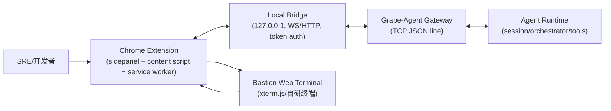

# Grape-Agent 堡垒机终端自动化方案（Google 浏览器插件 + Agent 适配）

## 1. 背景与目标

你要解决的问题是：

- 日常排障时，需要在堡垒机 Web 终端反复执行命令、查看日志、提炼线索
- 希望 Agent 能参与这个“输入命令 -> 看输出 -> 再输入命令”的闭环
- 最终实现更快的问题定位，但不突破安全边界

本文给出一套可落地技术方案，先支持 Google Chrome（兼容 Chromium 内核浏览器）。

## 2. 设计原则

1. 安全默认开启：默认人工确认执行，不默认全自动下发命令。
2. 最小权限：插件、桥接服务、Agent 各自只拥有必要权限。
3. 可审计：命令、输出、决策、执行路径都可回放。
4. 可降级：抓不到高质量终端流时，至少能做“只读分析模式”。
5. 协议先行：先定消息协议与状态机，再实现组件。

## 3. 总体架构



### 3.1 组件职责

- Chrome 插件
  - 负责终端页面检测、输出捕获、命令注入、用户确认交互
  - 不直接接入 Grape-Agent TCP Gateway
- Local Bridge（本地桥接服务）
  - 做协议转换、鉴权、节流、脱敏、审计落盘
  - 向 Grape-Agent Gateway 发请求
- Grape-Agent（现有项目）
  - 使用 `sessions.*` 管理诊断会话
  - 可通过 `channels.send` 或后续 `webterm` 通道回发建议

## 4. 运行模式设计

### 4.1 模式 A：只读分析（MVP 建议先做）

- 插件只采集终端输出，不自动下发命令
- Agent 返回“下一步建议命令 + 理由”
- 用户手动点击“执行”

优点：

- 最安全，最容易过内部安全审计

### 4.2 模式 B：半自动执行（推荐第二阶段）

- Agent 给出命令后，插件弹窗确认
- 用户同意后由插件注入输入并回车

优点：

- 提升效率，同时有人在环

### 4.3 模式 C：受控自动执行（第三阶段）

- 白名单命令可自动执行
- 高风险命令必须人工确认

## 5. 终端接入技术方案

堡垒机页面终端通常是 `xterm.js` 或类似实现。建议采用“双通道抓取 + 标记包裹执行”。

### 5.1 输出捕获

优先级：

1. Hook `xterm` API（若可访问）
2. 监听终端 DOM 变化（MutationObserver）
3. 兜底抓屏 OCR（不推荐，成本高）

输出预处理：

- 去 ANSI 控制字符
- 合并碎片 chunk
- 维持时间戳和序号
- 大块文本按长度切片

### 5.2 命令注入

优先级：

1. 调用终端输入 API（如 `term.paste` / `term.write`）
2. 定位隐藏 textarea 并分发键盘事件

### 5.3 结果边界识别（关键）

对每次命令用包裹标记：

```bash
echo __MA_BEGIN_<trace_id>__
<command>
echo __MA_END_<trace_id>__$?
```

这样可以准确截取“本次命令输出”和退出码，避免和历史滚动输出混淆。

## 6. 插件实现方案（Chrome Manifest V3）

## 6.1 目录建议

```text
browser-plugin/
  manifest.json
  src/
    service-worker.ts
    content/
      terminal-hook.ts
      injector.ts
      parser.ts
    sidepanel/
      index.html
      app.ts
    shared/
      protocol.ts
      storage.ts
```

### 6.2 核心模块

- `content script`
  - 注入到堡垒机页面，负责终端输入输出桥接
- `service worker`
  - 管理插件生命周期、与 Local Bridge 长连接
- `sidepanel`
  - 显示 Agent 建议、执行确认、会话状态、风险提示

### 6.3 权限建议

- `host_permissions`: 仅允许堡垒机域名白名单
- `permissions`: `storage`, `scripting`, `activeTab`, `sidePanel`
- 严禁 `"<all_urls>"`

## 7. Local Bridge 方案

### 7.1 技术选型

可选：

- Python FastAPI + Uvicorn（与你当前 Python 主体一致）
- 或 Node.js（插件生态友好）

建议首版用 Python，便于直接复用 grape-agent 的配置与日志风格。

### 7.2 Bridge 对外接口（插件调用）

- `POST /v1/session/open`
- `POST /v1/session/{id}/ingest`
- `POST /v1/session/{id}/suggest`
- `POST /v1/session/{id}/execute`
- `GET  /v1/session/{id}/state`

鉴权：

- 插件安装时生成本地 token，存 `chrome.storage.local`
- 每次请求 `Authorization: Bearer <token>`

### 7.3 Bridge 到 Grape-Agent Gateway 映射

- 建议命令请求
  - `sessions.send`（把最新终端输出作为消息送入会话）
- 查看历史
  - `sessions.history`
- 子任务分析
  - `sessions.spawn`（可用于并行日志片段分析）

## 8. Agent 侧适配方案

当前项目已有：

- Gateway `sessions.*`、`cron.*`
- 多代理路由
- 通道插件框架

新增建议：

1. 增加 `webterm` 任务模板 Prompt（独立于普通聊天）
2. 增加命令策略器（白名单/黑名单/风险分级）
3. 增加专用工具：
  - `propose_terminal_command`
  - `assess_command_risk`
  - `summarize_terminal_evidence`

## 9. 协议草案

### 9.1 插件 -> Bridge：输出上报

```json
{
  "session_id": "wsess_001",
  "trace_id": "tr_20260310_001",
  "host": "bastion.example.com",
  "tab_id": 321,
  "chunk_index": 12,
  "timestamp_ms": 1770000000000,
  "terminal": {
    "scope": "prod-a",
    "user": "ops_xxx"
  },
  "payload": {
    "type": "stdout",
    "text": "...."
  }
}
```

### 9.2 Bridge -> 插件：执行建议

```json
{
  "session_id": "wsess_001",
  "trace_id": "tr_20260310_002",
  "action": "suggest_command",
  "risk": "medium",
  "command": "grep -n \"error\" /var/log/app.log | tail -n 200",
  "reason": "定位最近异常栈",
  "requires_confirm": true
}
```

### 9.3 Bridge -> Gateway：请求示例

```json
{
  "id": "req_webterm_001",
  "method": "sessions.send",
  "params": {
    "session_key": "agent:main:webterm:bastion_prod_a_user_x",
    "message": "【终端输出片段】....",
    "wait": true
  },
  "auth": {
    "token": "grape-agent-gateway-dev-token",
    "client_id": "webterm-bridge",
    "role": "operator"
  }
}
```

## 10. 安全控制设计

### 10.1 命令策略

- `allowlist`：`grep`, `tail`, `cat`, `less`, `awk`, `sed`, `journalctl`, `kubectl logs` 等
- `denylist`：`rm`, `shutdown`, `reboot`, `mkfs`, `iptables`, `userdel`, `chmod -R 777 /` 等
- `confirm_required`：涉及写操作、重启操作、配置变更操作

### 10.2 数据脱敏

上传到 Agent 前自动掩码：

- API Key / Token / Secret
- 手机号、邮箱、身份证号（按需）
- 内部账号敏感字段

### 10.3 审计日志

至少记录：

- 谁在何时发起
- 执行了什么命令（含风险级）
- Agent 给出什么建议
- 命令退出码与摘要输出

## 11. 失败场景与降级

1. 页面结构变化导致 Hook 失效
  - 降级为“手工复制输出 + Agent 分析”
2. Bridge 与 Gateway 断连
  - 本地缓存输出 chunk，重连后回放
3. 输出过大
  - 分片上传 + 摘要优先 + 按 trace_id 拼接

## 12. 分阶段实施计划

### Phase 1：MVP（1-2 周）

- 插件能抓终端输出
- Bridge 能转发到 Gateway
- Agent 返回下一条建议命令
- 用户手工确认执行

验收：

- 至少 3 个真实排障案例可走通闭环

### Phase 2：半自动（1 周）

- 一键执行建议命令
- 加入命令风险分级与确认弹窗

验收：

- 命令执行成功率 > 95%

### Phase 3：受控自动（1-2 周）

- 白名单命令自动执行
- 审计与告警完善

验收：

- 可通过内网安全评审

## 13. 与当前 Grape-Agent 对接的最小改造点

1. 保持 Gateway 作为控制面入口
2. 新增一个 `webterm` channel 标识（可先不做完整 channel 插件）
3. 在 Bridge 层复用 `sessions.send/history/spawn`
4. 增加一个专用系统提示词文件：`system_prompt_webterm.md`

## 14. 建议的下一步开发顺序

1. 先做 Local Bridge（最关键）
2. 同步做 Chrome 插件 MVP（只读分析）
3. 打通 `sessions.send(wait=true)` 的建议闭环
4. 再加执行确认与命令注入

---

如果后续按本文实施，我建议先从“只读分析模式”起步，在确认稳定和合规后再逐步开放自动执行能力。
