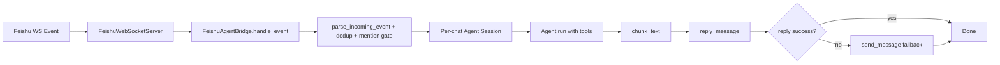

# Grape-Agent 飞书插件技术实现文档

## 1. 目标与范围

本文档说明在 Grape-Agent 中如何实现飞书（Feishu/Lark）长连接插件，使 Agent 能与飞书机器人进行**双向通信**：

- 入站：飞书消息 -> Agent
- 出站：Agent回复 -> 飞书会话

实现文件集中在：

- `grape_agent/feishu/server_ws.py`
- `grape_agent/feishu/bridge.py`
- `grape_agent/feishu/client.py`
- `grape_agent/feishu/message_utils.py`
- `grape_agent/feishu/dedup.py`
- `grape_agent/feishu/types.py`

并新增：

- CLI 启动入口 `grape-agent-feishu`（`pyproject.toml`）
- 依赖 `lark-oapi`
- 单测 `tests/test_feishu_message_utils.py`

---

## 2. 设计原则

参考 openclaw 的飞书通道思路，在 Grape-Agent 中采用以下原则：

1. 长连接优先：使用飞书官方 SDK WebSocket 长连接，不依赖公网回调地址。
2. 通道与 Agent 解耦：飞书适配层负责“消息收发与会话路由”，Agent 核心逻辑不改。
3. 会话隔离：按 `chat_id` 维护独立 Agent 会话与 workspace。
4. 幂等与稳定：入站消息去重、群聊触发门控、失败回退发送、长文本分片。
5. 兼容 SDK 差异：处理 `lark-oapi` 版本在事件循环与 API 形态上的差异。

---

## 3. 架构总览



### 3.1 模块职责

#### `server_ws.py`

- 进程入口与参数解析（`--app-id/--app-secret/--domain/...`）
- 初始化飞书 WS 客户端和事件分发器
- 处理 SDK 线程/事件循环模型（主线程跑 WS，后台线程跑 asyncio bridge loop）
- 信号处理与优雅关闭

#### `bridge.py`

- 入站事件主流程 `handle_event`
- 去重、群聊 @ 触发过滤、`/clear` 会话重置
- 会话创建与缓存（`chat_id -> Agent`）
- 调用 Agent 生成回复并出站发送

#### `client.py`

- 封装飞书 SDK 的消息发送、回复、bot 信息查询
- 使用 typed API：
  - `client.im.v1.message.create(...)`
  - `client.im.v1.message.reply(...)`
- 统一返回 `FeishuSendResult`

#### `message_utils.py`

- 解析飞书事件 payload（text/post）
- 提取并剥离 @bot mention
- 长文本按换行优先分片（默认 3000 字符）

#### `dedup.py`

- 持久化去重缓存（TTL + 最大条目）
- 文件：`~/.grape-agent/feishu/dedup.json`

---

## 4. 消息流（双向通信）

### 4.1 入站：飞书 -> Agent

1. 飞书事件 `im.message.receive_v1` 到达。
2. `server_ws.py` 将事件投递到 bridge 异步循环。
3. `bridge.handle_event` 执行：
   - `parse_incoming_event`
   - 去重 `dedup.seen_or_record(chat_id:message_id)`
   - 过滤 bot 自己发出的消息
   - 群聊下默认要求 `@bot` 才触发（可 `--group-open` 放开）
   - 清理 mention 文本
4. 构造用户输入并送入会话对应 `Agent.run()`。

### 4.2 出站：Agent -> 飞书

1. 先发送“处理中”ack（回复原消息）。
2. Agent 完成后得到最终文本。
3. `chunk_text` 分片（超长回复拆包）。
4. 第一片优先 `reply_message`；失败回退 `send_message`。
5. 后续分片直接发到 chat。

---

## 5. 会话与状态管理

### 5.1 会话粒度

- Key：`chat_id`
- 每个 chat 独立 `Agent` 与 `asyncio.Lock`
- 同 chat 串行处理，避免并发写入同一消息历史

### 5.2 Workspace 隔离

- 根目录：`~/.grape-agent/feishu_workspaces`
- 子目录：`~/.grape-agent/feishu_workspaces/<chat_id>`
- 工具（读写/bash/note）全部绑定到会话 workspace

### 5.3 记忆工具

- 基础 note 工具沿用 CLI 装配
- 额外补充 `RecallNoteTool`，形成“可写 + 可读”闭环

---

## 6. 稳定性与容错策略

1. 持久化去重：避免 SDK 重连、重复投递导致重复执行。
2. 回复失败回退：`reply_message` 失败自动 fallback `send_message`。
3. 文本分片：避免单条消息长度限制导致发送失败。
4. 群聊门控：默认仅 @bot 执行，降低误触发。
5. 会话命令：支持 `/clear`、`/reset`、`/new` 快速重置上下文。
6. 事件循环兼容：
   - `lark-oapi` WS 客户端内部使用模块级 event loop
   - 采用“主线程 WS + 后台 asyncio bridge loop”避免 `This event loop is already running`

---

## 7. 与 openclaw 思路对齐点

吸收并落地了 openclaw 飞书通道中最关键的工程实践：

- 入站去重（含持久化）
- 群聊 mention gate
- 回复失败 fallback
- 文本分片发送
- 会话与通道解耦（transport 与 agent bridge 分层）

本项目当前版本是精简实现，优先保证“稳定收发 + 可维护结构”。

---

## 8. 启动与验证

### 8.1 启动命令

```bash
grape-agent-feishu \
  --app-id "cli_xxx" \
  --app-secret "xxx" \
  --config grape_agent/config/config.yaml
```

### 8.2 联调验证步骤

1. 确认飞书开发者后台已开启事件订阅长连接，并订阅 `im.message.receive_v1`。
2. 启动服务，观察日志出现 `connected to wss://msg-frontier...`。
3. 在飞书中给机器人发消息（群聊建议 @bot）。
4. 观察服务日志是否进入 Agent Step。
5. 在飞书确认是否收到机器人回复。

---

## 9. 测试

新增单测：`tests/test_feishu_message_utils.py`

覆盖点：

- 入站事件解析
- mention 清理
- 文本分片
- 去重缓存行为

执行：

```bash
.venv/bin/pytest -q tests/test_feishu_message_utils.py
```

---

## 10. 已知限制与后续增强

### 10.1 已知限制

1. 当前 `bot/v3/info` 解析在部分租户/权限下可能拿不到 bot 名称，不影响收发主链路。
2. 暂未实现“多账号 Feishu 账户路由”（当前按单账号启动）。
3. 暂未做流式增量回包（当前是完成后一次/分片回复）。

### 10.2 后续建议

1. 增加发送重试与指数退避（网络抖动场景）。
2. 增加消息审计日志（入站/出站 message_id 对账）。
3. 增加群策略：白名单群、白名单用户、线程内回复策略。
4. 增加多账号配置模型（账号级 domain/权限/策略）。

---

## 11. 安全建议

1. `app_secret` 不要写入仓库，优先环境变量或密钥托管。
2. `config.yaml` 建议仅保留模板，真实密钥使用本地覆盖文件。
3. 日志中避免打印完整 token/secret。

